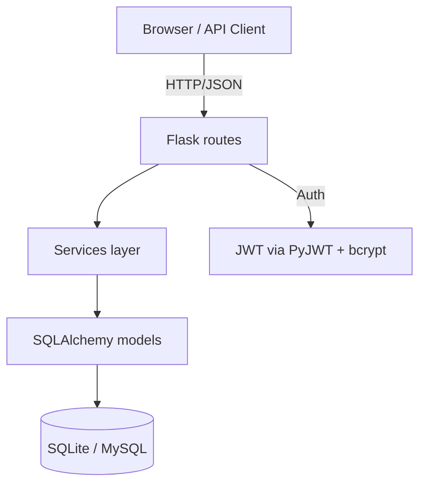

# brainstormer — Architecture

## Overview
A Flask web application using a modular layout with an app-factory pattern. The
default database is SQLite (via Flask-SQLAlchemy); swap to MySQL by setting
`DATABASE_URL` and running Flask-Migrate.

## Components

- **routes/** — HTTP layer; blueprints for `health` and `auth`
- **services/** — business logic (add service modules per domain here)
- **models/** — SQLAlchemy models (`User`)
- **utils/** — thin wrappers over `flask-appkit` (`auth`, `decorators`, `responses`)

## Data flow (example: login)
1. Client `POST /api/auth/login` with email + password
2. Route validates the user and password
3. On success, a JWT access token is returned
4. Protected routes read the token via the `token_required` decorator

## Configuration
All configuration flows from environment variables (`.env`) — see
`config.py`. Secrets are never committed.

See also: [ERD](erd.md), [Install & configuration](install-config.md).
