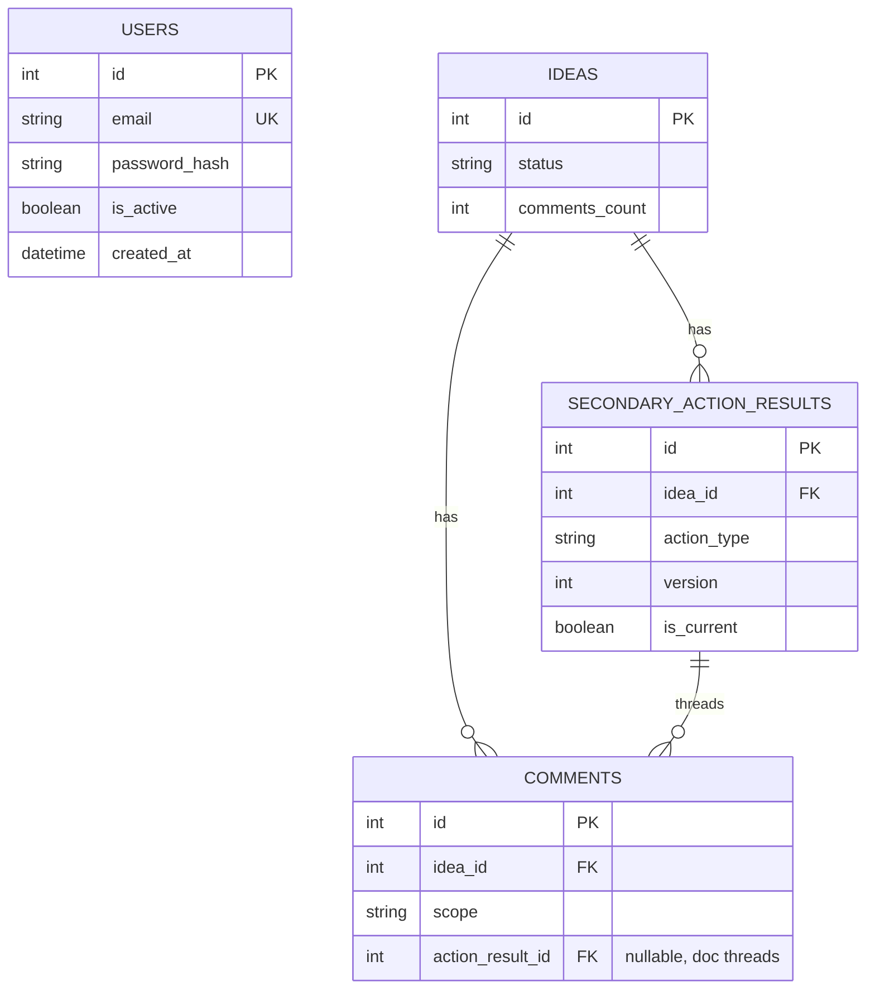

# brainstormer — Entity Relationship Diagram

```mermaid
erDiagram
    USERS {
        int id PK
        string email UK
        string password_hash
        boolean is_active
        datetime created_at
    }
    IDEAS {
        int id PK
        string status
        int comments_count
    }
    COMMENTS {
        int id PK
        int idea_id FK
        string scope
        int action_result_id FK "nullable, doc threads"
    }
    SECONDARY_ACTION_RESULTS {
        int id PK
        int idea_id FK
        string action_type
        int version
        boolean is_current
    }
    IDEAS ||--o{ COMMENTS : has
    IDEAS ||--o{ SECONDARY_ACTION_RESULTS : has
    SECONDARY_ACTION_RESULTS ||--o{ COMMENTS : threads
```
